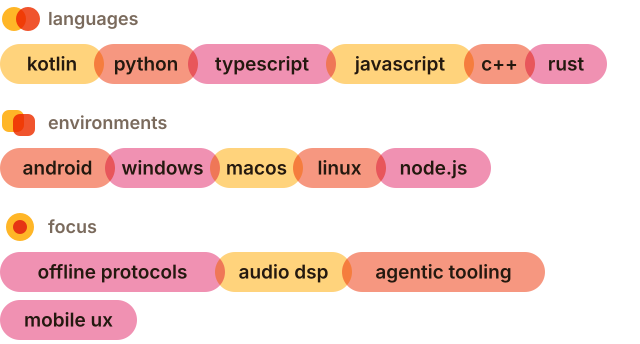

  

&nbsp;

&nbsp;

  

> *"every elegant solution eventually creates a new, much worse problem."*

## 

i build weird software to kill time and occasionally it turns into something useful.

outside of code: i take photos of cats, collect random cat facts, and doodle when i'm bored. also soup. I love making soup. *(yes, souphater.page. no, i don't hate soup.)*

## 

records a voice note on android and pastes it straight into whatever chat you're in. fully finished. typing on glass sucks.

ai lesson-prep tool for teachers. repo opens on the native macos app, with a native [windows](https://github.com/walsoup/Fichegen/tree/windows-native) build on its own branch. original python script still on `main`.

## 

private finance tracker, encrypted local db, zero telemetry. works completely offline, with an api option if you actually want to sync. mostly done — just fixing visual bugs.

android ble mesh network, plus internet over bluetooth with no root.

small autonomous agent loop with streaming, reasoning logs, human approval.

## 

web compass for long-distance couples that lights up when you're facing each other.

check your moroccan grades without waiting on the heavy portal.

## 

  

  

